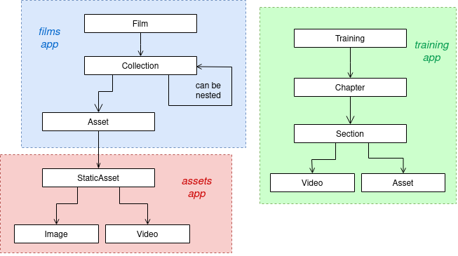

# Architecture Overview

Apps:
 - [blog](#blog)
 - [comments](#comments)
 - [common](#common)
 - [films](#films)
 - [search](#search)
 - [static_assets](#static-assets)
 - [subscriptions](#subscriptions)
 - [training](#training)

To be extracted to a separate app:
 - [progress](#progress) - currently inside [training](#training)

Other:
 - **Project** - this word may refer to a film or a training. We don't have a `Project` model at
   the moment, but there's a chance that it changes in the future.
 - flat pages - at the moment only used for the films' ["About" pages](#film-flat-pages).

### Models (simplified) hierarchy

The main, 'highest-level' models in the entire project are the **Film** and **Training**.

##### Film
Resources related to films are gathered in **Collections**, which can contain further (nested)
collections, as well as **Assets**. An asset represents an individual resource displayed on the web page,
such as an artwork or a production file, also including the metadata (e.g. its ordinal number for ordering
in the collection, or description).

Films also have **Production Logs**, containing all the work published during a given week by all the
authors. Production Logs are made up of **Production Log Entries**: sets of **Assets** created
by individual authors. The Assets in the Production Log Entries are the same objects that are also
displayed in Collections.

On a lower level, each asset has a foreign key to a **Static Asset**, which represents the asset file
itself: a video, an image, or another file. Data included in the Static Asset model refers to the file
(e.g. author, license, etc.), and not to the place where it is displayed.

Static Assets which are videos or images have additional models -- **Video** and **Image**,
respectively -- with a OneToOneField to Static Asset. These models contain some additional fields
with information specific to videos and images.

##### Training
Trainings comprise **Chapters**, which in turn contain **Sections**.
The main difference between chapters and films' collections is that collections can be nested.
The Section model is linked to a **Video** via a OneToOneField. Together, they form an equivalent
of an Asset with a Static Asset in films, more or less.

In training, there also is an **Asset** model, but it differs from the Asset model in films.
It represents an extra file attached to a Section.

## Blog

Posts will usually be related to films, and displayed in the 'Weeklies' section
alongside production logs.

In the blog page, only the published posts are listed. The same holds for the search results.

The blog `Post` model has an `is_published` field, as well as `date_published`, set
`is_published` to `True` and `date_published` to a suitable date when the blog post
is ready to be published.

## Comments

Comments are a self-contained, reusable app. We don't want to have to change their
models whenever they are reused for another app, so they shouldn't be linked to external
models in any way.

How to add comments to a new model — say, `Asset`:

- in the `Asset`, add a `ManyToMany` field `comments`,
- define an intermediary model for `Comment` and `Asset`, e.g. `AssetComment`, and set
it as the `through` argument of the `Asset.comments` field,
- in `AssetComment`, add a `ForeignKey` to `Asset`,
- and a `OneToOneField` to `Comment` (each `AssetComment` should only relate to one
`Comment`).

Comment actions are handled with pure JS.

## Common

The `common` app contains the code that is used (or we plan to use it) in more than one app:
scripts, template bases or components, test factories, utility functions, etc.

## Films

##### Film
A **Film** has three `status` options (defined in the `FilmStatus` text choices class):
0. in development
1. in production
2. released
Films in development and production have their [production logs](#production-logs--weeklies)
displayed in their detail page.

**Collections** can contain film-related assets. They can also contain other collections
(nested collections). For now, the front end does not expect nested collections to
contain further nested collections. However, this restriction does not apply at the
database level. Collections in a film or a parent collection are sorted in the view by
their `order` and `name` attributes - just like [the assets](#asset-ordering).

An asset can have comments (from the [comments](#comments) app, linked via the intermediary
**AssetComment** model).

##### Asset ordering
Assets in a collection are sorted by their `order` and `name` attributes. The `order` field
is not required, there is also no constraint on it to enforce unequivocal ordering in a collection,
hence the additional `name` field.
Maintaining consistent ordering is difficult, especially if the order of collections or asset changes,
and it would be even more difficult with the above mentioned restrictions in place. It would be
useful to have the `order` attributes in the entire collection reassigned automatically whenever
a user changes the `order` of one asset.

##### Asset (model in films app) vs. StaticAsset (model in static_assets app)
- Static Asset is more "low-level" and represents an uploaded file; we want to have a less
generic model that could be extracted and reused in other apps (e.g. blog, training).
Therefore Static Asset should not contain any relationships to other apps.
- Asset contains the metadata, and represents the web page where the file (artwork, training video, etc.)
is displayed. As a model in the 'films' app, asset may belong to a Collection, and is a part (leaf)
of the tree-like structure of film-related resources.

<table>
    <tr>
    <td>Caution: There's also an `Asset` model in the training app, but it represents
    a slightly different thing: it is an additional file related to a training section
    (not its main video).</td>
    </tr>
</table>

##### `is_published` flag
Film and Asset models have the `is_published` flag. It is set to `False` by default. It could be
useful to prepare a model instance in advance, and publish it with simply a change of the flag
at an appropriate moment. The Collection model doesn't have such a flag.

In film-, collection- and asset-related views, the respective querysets are filtered to only include
the objects with `is_published=True`. For example, attempting to access an asset in an unpublished
film should result in a 404 Not Found error, even if the asset itself is marked as published.

##### Production Logs / Weeklies
The production logs are also called "weeklies" or "production weeklies" in the website and the admin
panel. We stick to "production logs" in the back end code, though.

- **ProductionLog** — all the log entries from one week. This is akin to a blog post, and can be shown
in the project timeline along with the blog posts (or a blog post could just mention that there's
a new production log available, and link to it).

- **ProductionLogEntry** — contains multiple assets, all created by one author during a particular week.
Assets in an entry are sorted by their creation date (`date_created` field).

- **ProductionLogEntryAsset** — an intermediary table between the `Asset` and `ProductionLogEntry` models.

At the moment, we don't consider it necessary to have any relation between a production log and a
blog post on the database level. This can all be handled manually.

Probably we'll need slugs for these objects later.

##### Film flat pages
<table>
    <tr>
    <td>In practice, at the moment we only use flat pages to create the "About" pages
    for films. They will likely be used for other things in the future, though.</td>
    </tr>
</table>

The `films.FilmFlatPage` model can be used to create film-related flat pages.
A flat page is stored in the database rather than in the codebase. Consequently,
it has to be created by hand for every film - this can be done via the admin panel.

Flat pages can be used to add sections to a film's page: a link to each flat page
will be added in the navigation bar. For example, the "About" section for each film
is a 'flat page'.

A flat page contents are expected to be formatted in Markdown, which is converted
to HTML on save, and stored in the `content_html` field.
We use [mistune](https://mistune.readthedocs.io/) to do the Markdown-to-HTML rendering.

Although this model has been inspired by the django.contrib.flatpages.models.FlatPage
model, its attributes and usage differ considerably from the 'original'. It should be
treated as a normal model therefore.

## Progress
Could be extracted to a separate app. Has to be added to films, too.

## Search
The search functionality uses [MeiliSearch](https://github.com/meilisearch/MeiliSearch).
It is a service separate from the back end. How we use it is described in more detail in
[a separate article](search.md#overview).

The search app does not define any models, but all the other search-related code is gathered
here.

## Static Assets
**Static Assets** represent the files uploaded in the cloud.

Static assets can be of three types (`source_type` attribute): image, video, or (a generic) file.

**Images** and **Videos** should be represented by their respective models: `Image` and `Video`,
which provide additional attributes like resolution or duration. These models additionally
have a one-to-one reference to a Static Asset instance, containing all the other data.

Preview pictures for all static assets are obligatory. However, for images and videos they can be
generated automatically (e.g. by the `sorl-thumbnail` library).

We want the entire `static_assets` app (i.e. file-representing models: `StaticAsset`, `Image`, `Video`)
to be portable, and independent of the other apps.

##### Licenses
For now, licenses are only added to static assets (image, video, file).

## Subscriptions
This has to be documented yet. It is not actually used at this stage.

## Training
A training consists of chapters, which in turn are made up of sections.
It has a "Training Status" choice field, with two values: published and unpublished.
It may be a good idea to replace this field with the `is_published` flag (like in
[films](#is_published-flag)).

Sections within a chapter are ordered by their `index` attribute. So are chapters in a
training.
The value of `index` has to be unique per chapter or training, respectively.

Each **Section** contains a video (its main content), represented by the **Video** model.
It can also contain an arbitrary number of other files, stored as **Asset** instances.
A section can have comments (from the [comments](#comments) app, linked via the
**SectionComment** model).

The training Asset model should not be confused with an identically named model in the
films app.
